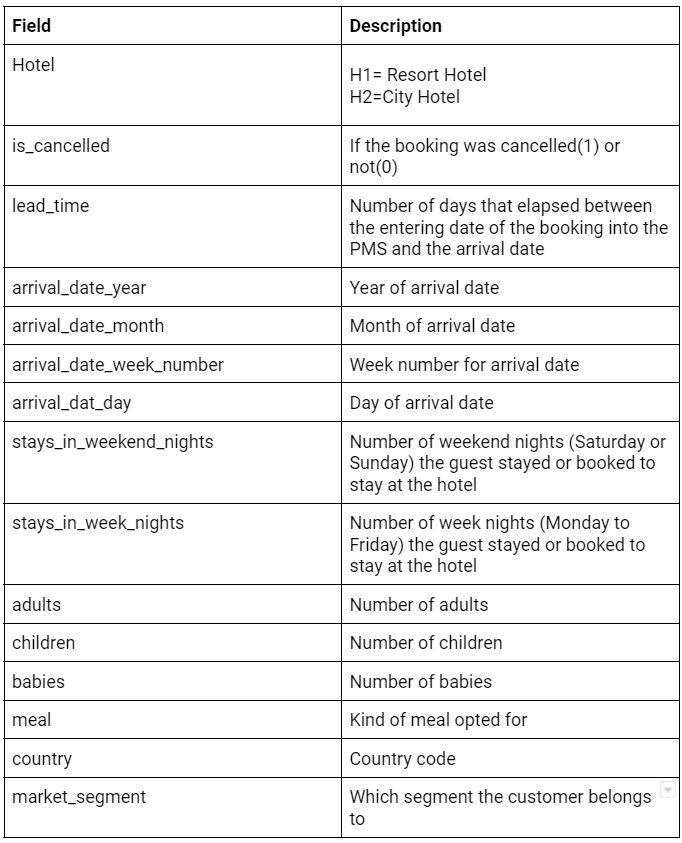
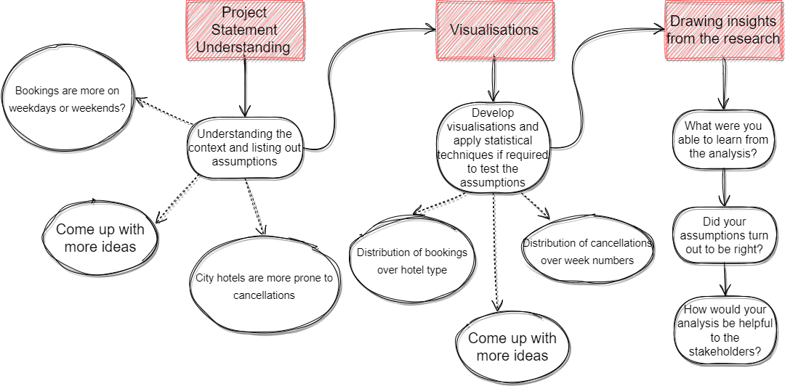

Business Context:

Have you ever considered the best time of year to make a hotel reservation? Or have you ever wondered what the perfect length of stay is to get the greatest daily rate? What if you wanted to predict whether a hotel will receive an exceptionally large volume of special requests? This dataset on hotel bookings provides useful information for answering these questions. It includes reservation information for both city hotels and resort hotels, such as reservation dates, length of stay, number of guests, children, babies, and available parking spaces, among other criteria. It's worth noting that all personally identifiable information has been deleted from the dataset to ensure privacy and security.
Explore and analyse the data to identify key elements that influence bookings.

Dataset Description:

Main Libraries to be used:

Pandas for data manipulation, aggregation
Matplotlib and Seaborn for visualisation and behaviour with respect to the target variable
NumPy for computationally efficient operations

Project Architecture:

